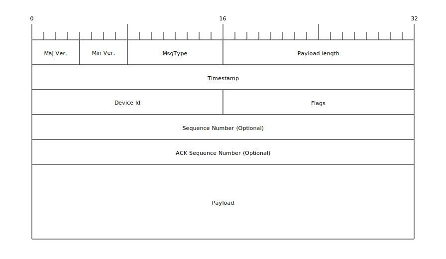

= Audience Participation
Florian Jung
v0.0.6, 2015-04-04
:doctype: book
:encoding: utf-8
:lang: en
:toc: left
:sectnums:
:chapter-label:
:pdf-page-size: A4
:stem: latexmath
ifdef::env-github,env-browser[:outfilesuffix: .adoc]

Version {revnumber} from {revdate}

:toc:

== Overview
For my bachelor thesis I developed a Raspberry Pi-based system for Audience
Participation in musical projects. I dubbed the core python software based on that
title *paps* (*P* i-based *A* udience *P* articipation *S* ystem). However if you
are not going to use a Raspberry Pi in your project, *paps* once more applies
(*P* ython-based *A* udience *P* articipation *S* ystem). If you want to go even
further and only use the interfaces and/or the network protocol for example, *paps*
still works (*P* articipation  *S* ystem). +
For a complete overview of the project see link:docs/project{outfilesuffix}[here]. +
For some insights on how this came to be and how the individual parts evolved,
have a look at the transcription of link:docs/notes{outfilesuffix}[my personal journal notes].

This is the documentation of the core python code.

=== Goals
The main goals for this project were:

* Easy: The code should be easy to read and understand (Which was the basis for
  the decision to use python)
* Extendibility: Clear and uniform interfaces to mix and extend components as needed
* Speed: Naturally speed is important, so why python?
  - The first goal (it being easy was more important than it being fast)
  - Python is usually fast enough. In most cases it does quite well, especially
  after you have done some optimizing. Additionally there are several ways to improve
  speed even more, like using different interpreters (pypy,..) or taking advantage
  of the close relationship to c (cpython, writing your own c code,...). +
  Also, realtime processing/reaction would be nice, but is not a requirement.
* Scalability: The system should not have to handle millions of people, relying
  on load-balancers, but it should work with anything from a handful to a hundred.

== Installing
=== Environment
All the code is writing in python 2, specifically 2.7. I have taken some first steps
to support python 3 as well, but at this point it probably will not work yet. +
Tough I have been developing mostly under windows, it has been tested to some degree
on other platforms (OSX, Raspbian) too.

=== Basic installs
The first thing you need is a working python environment:

* Install the latest version of link:https://www.python.org/downloads/[python 2.7]
* Install/get the latest version of link:https://pip.pypa.io/en/stable/installing/[pip]

.RECOMMENDED
[NOTE]
I recommend working on and running your code in a virtual environment. +
You can use link:https://virtualenv.pypa.io/en/latest/[virtualenv]

=== Paps install
==== PyPI
If you want to use paps in your own project, it is available from link:https://pypi.python.org/pypi[PyPI]. +
Simply install it via `pip install paps` or add paps to your requirements file.

==== Manuel
Get the latest version from github and simply run `python setup.py install`. That
installs every dependency and you are good to go.

=== Paps development
If you want to work on paps and develop it further, use the `Manuel` installation
method, but change `python setup.py install` to `python setup.py develop`. That
way any changes you make take immediate effect. I also recommend installing the
development-dependencies ( `pip install -r dev-requirements.txt`. +
Finally don't forget to send me a pull request.

== System
=== Core concepts
==== Person
Although paps was developed in the context of a musical project, it is designed
as an general audience participation framework, not limited to a single use case. +
Naturally the core entity used throughout the system is creatively called `Person`.
It represents an audience member and its current state. +
At this point a Person only has two properties, an id and a field to indicate whether
the represented individual is standing up or sitting down. However as long as all
the transform functions (to_/from_dict, to_/from_bits,..) in
link:https://github.com/the01/python-paps/blob/master/paps/person.py[person.py]
are changed, paps itself should continue to work as expected (the sensorServer might
need a few adjustments). Keep in mind that not every plugin (see later) might be
as lenient in the type of Person it can work with.

==== Flotils
Most classes inherit in one way or the other from the link:https://github.com/the01/python-flotils[flotils]
package. Most notable are the `Logable` and `StartStopable` classes. `Logable` adds
logging capabilities to an instance (as best demonstrated on the above git page).
'StartStopable', as the name suggests, provides methods to start and stop a class
instance. Calling start with True as the parameter is blocking, which means it will
only return after stop has been executed. Additionally it provides a boolean variable
indicating its current state (running or not).

==== ChangeInterface
The other core concept besides a Person is the
link:https://github.com/the01/python-paps/blob/master/paps/changeInterface.py[`ChangeInterface`].
It represents the most generic actions a person can take

* *on_person_new*: This occurs when a person has just joined the audience. In other
words she was not known to the receiving component before.
* *on_person_update*: The state of a person has actually changed. (No person for
  whom that is not true should not be included here)
* *on_person_leave*: A person has left the audience and should not be considered
from this moment on.

The ChangeInterface is mostly used at borders between different layers of the system
(physical sensors detecting actual humans, the SensorServer receiving events from
clients, the CrowdController forwarding changes, ..). +
It is recommended to use/implement whenever Person information needs to be exchanged.

=== Network communication
The first step was to decide how the different sensors would be communicating with
the server. Ease of installation and avoiding extra components being primary concerns,
I decided on LAN. (Almost) all Raspberry Pis come equipped with an ethernet port.
This was before the Pi 3 was announced on February 29th 2016, which offers onboard
WIFI as well as Bluetooth. I would have still settled on LAN, because of the higher
transfer rates and stability. +
The downside of course being, that now every sensor has to be connected to the
network via cable. On the other hand one could eliminate the power cable by using
power over ethernet (PoE).

==== Audience Participation Protocol (APP)
Keeping the project goals in mind and wanting to keep the network traffic as low
as possible, I decided to design my own protocol. +
TCP as the basis would be easy. It guaranties reliable, correct and ordered packet
delivery. Definitely good properties for a protocol to have. +
Since People coming/leaving (in the context of ChangeInterface) only happens at
the beginning/end, most of the traffic will consist of update events. Keeping hundreds
of TCP connections (and sockets) open for that single purpose seems unpractical. +
So I opted for a UDP-based protocol.

The protocol uses big-endian encoding.

===== APP Header

*Protocol field* (C Type): Description of field

*Version* (unsigned char)
*Maj Ver* (nibble): Major part of protocol version

*Min Ver* (nibble): Minor part of protocol version

*MsgType* (unsigned char): Message Type/type of packet

* 0: (ACK) Empty packet - only acknowledging packet
* 1: JOIN-Packet
* 2: CONFIG-Packet
* 3: UNJOIN-Packet
* 4: UPDATE-Packet
* 5: DATA-Packet

*Payload Length* (unsigned short): Length of the payload (in bytes)

*Timestamp* (float): Unix timestamp of packet creation/transmit time

*Device Id* (unsigned short): Device id of sender.

* 0: (REQUEST) Request a new id from server
* 1: (SERVER) Id of a server.
* 2-65536: Possible client id

*Flags* (unsigned short): Set flags. To use several in the same packet either add
the values or do a bit-wise or.

* 1: (SEQ) Is a sequence number present
* 2: (ACKSEQ) Is an acknowledged sequence number present

*Sequence Number* (optional)(unsigned int): Sequence number of packet. If present,
SEQ flag has to be set. If present, requires an ACK to be sent. +
By using this you can ensure packet delivery.

*ACK Sequence Number* (optional)(unsigned int): Acknowledge for packet with this
Sequence Number. If present, ACKSEQ flag has to be set. +
A dedicated ACK-Packet is not needed. By setting this field, any packet can become
an ACK-Packet.

*Payload* (Payload Length number of bytes): Payload content is dependent on the
type of packet/message being transmitted

===== APP JOIN Message
Message to join the local audience and comparable to `ChangeInterface.on_person_new`.
This can be sent to the server directly or, to enable auto-discovery capabilities,
to a multicast group (Recommended: 239.255.136.245). Of course a server first has
to make a membership request for that group. +
The payload consists of a string with a json object containing all information
required to join the audience. The absolute minimum is a field `people` with an
array of the people (Person) this client offers as a json object (python dict)
encoded (see following code). Additional fields may be added as needed, but are
not part of the APP specification. +
APP requires that all the people have to be announced at join-time. If you want
to add people at a later point, unjoin first and then re-join with the updated
people list. +
The `device id` field of the header may be either set to REQUEST (0) or to a valid
client id (2-65536). Providing a client id much like with dhcp only serves as an
request for that id, the server can choose to assign a different one. The logic
on how to handle id collisions and to identify clients between runs is left to the
concrete implementation. Though some possible approaches could involve MAC-addresses
or issuing unique ids.

[source, json]
----
  {
    "people":[Object representation of Person]
  }
----

Requires an ACK-Packet to be sent.

===== APP CONFIG Message
Message to change the configuration (of a client). +
The payload consists of a string with a json object containing all configuration
changes. If a settings parameter is not present, it should not be changed. +
The parameter names can be chosen freely (in accordance with json), except for these
reserved ones:

* device_id: New device id assigned to this client
* server_ip: The IP where the server can be reached. (Auto-discovery over multicast is deeply integrated into APP -  though not required)
* server_port: The port where the server can be reached.

Requires an ACK-Packet to be sent.

===== APP UNJOIN Message
Message to leave to local audience and comparable to `ChangeInterface.on_person_leave`. +
Informs the server that all people associated with this client are leaving the audience. +
This packet does not have any kind of payload, which means the server has to keep
track of who (people) are registered with this client.

Requires an ACK-Packet to be sent.

===== APP UPDATE Message
Message to update the state of people and comparable to `ChangeInterface.on_person_update`. +
Since this is most likely the most (concurrently) sent packet, most of speed and
size considerations were taken here. It does NOT require an ACK-Packet to be sent,
cutting the number of packets in halve. However the basis for APP is still UDP,
so packet loss is a possibility. To address this, every UPDATE message needs to
contain the state of ALL people being monitored by this client. This reduces the
chance of lost information especially under the following assumptions:

. A single client monitors not just one person, but multiple.
. People seated closely together, move together. If the person next to you stands
  up, you are likely to move as well.
. People are placed together in few groups.
. It only matters for a group how *many* people are in a certain state, not which
  ones.

Following these assumptions, consider this thought experiment: +
You and the two people sitting to your left and your right are in the same group
(your actions have the same result), as well as your seat sensors being connected
to the same client (Raspberry Pi) [assumption 1]. Lets visualize that state in the
following way
*[seated, seated, seated]*. Now the person on your left stands up, changing the
simple overview to *[standing, seated, seated]* and triggering the client to send
this change to the server. Next you and then your other neighbour stand up
(not necessarily because of herd mentality, but maybe the conductor has told your
group to stand up) [assumption 2], the state changes to *[standing, standing, seated]*
and finally *[standing, standing, standing]*. These changes also get transmitted
to the server. +
Even if the first two packets in this scenario were lost, as soon as the third arrived
at the server, it would have the complete and correct state of your group (at least
the ones connected to your client). It would get that information a little
later, but we have cut the traffic by 5 packets (1 x resent UPDATE-packet
& 1 x ACK-Packet for each of the two lost packets + 1 x ACK-packet for the last
UPDATE that did not get lost) +
If however the first and last packets were lost, then the information about your
right neighbour standing up would not have reached the server. +
But if you consider that UDP-packets are more likely to be dropped with

.. bigger packet sizes +
.. more packets on the network

you can look at strategies to decrease the chances/impact. +
Lets consider b). More packets mean more people (updates), which also means either
packet loss is less/not very likely or we have many people. We do not have a problem
in the first case and in the second only a few people will have wrong state
information (see example scenario above). Because of [assumption 3] group sizes
will be big, but because of that and [assumption 4] a single (or few) person being
misrepresented will not have much negative impact on the group as a whole. +
a) is also being addressed by APP. A person implements transformation functions
to and from a bit-representation. Currently this only consists of the sitting-state: +
`0` = is not sitting; `1` = is sitting. +
Since the UPDATE-packet requires the state of all people be present in the payload,
 the device id can be omitted, but the same order as in the JOIN-packet has to be
 kept to still be able to identify each person. +
The bit-representation then gets packed into bytes and the information start indicated
by a marker (`1`) +

====== Examples
`P(0,sit)` means a Person with id = 0 is sitting +
`P(1,!sit)` means a Person with id = 1 is not sitting

|===
|Name of Column 1 |Bit representation |Hex representation

|`P(0,!sit)`
|10
|0x02

|`P(1,!sit)`
|10
|0x02

|`P(0,sit)`
|11
|0x03

|`P(0,!sit);P(1,sit)`
|101
|0x05

|`P(0,!sit);P(1,!sit);P(2,sit);P(3,!sit);P(4,sit);P(5,!sit);P(6,sit)`
|1001 0101
|0x95

|`P(0,!sit);P(1,!sit);P(2,sit);P(3,!sit);P(4,sit);P(5,!sit);P(6,sit);P(7,sit)`
|1 0010 1011
|0x012b
|===

===== APP DATA Message
A DATA message enables the protocol to transmit data of some kind as a json encoded
string.

Requires an ACK-Packet to be sent.

===== Known problems
APP was designed with a certain environment and simplicity in mind. A closed off
network only for APP devices, no malicious clients and no or next to none other
traffic. +
The result is a very naïve protocol. It has few or no control, authentication or
security features built in. It is also very susceptible to tampering (intentional
and unintentional) and potential denial of service attacks.

== How to
include::docs/write_plugin.adoc[leveloffset=+2]
